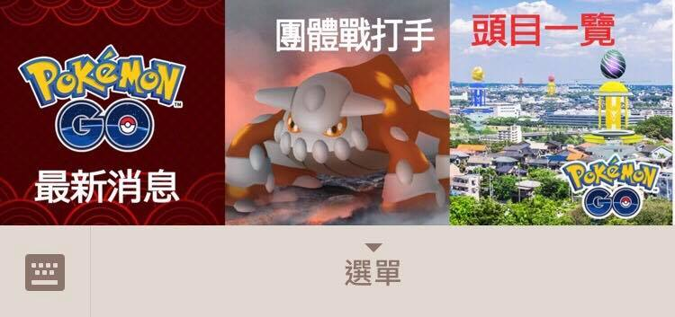

# Pokemon Go 團體戰小幫手

## 使用工具

* Python
* Django + Database
* LINE Bot API
* imgur
* ngrok (測試用)

## 功能

### v1.0

以點按圖文訊息為主，提供以下功能

1. 團體戰攻略 (圖片)
2. 團體戰頭目一覽 (圖片)
3. 最新消息 (更新中...)

## Demo

### 圖文選單

### 團體戰打手

1. 按鈕樣板
2. 傳送文字

### 頭目一覽

