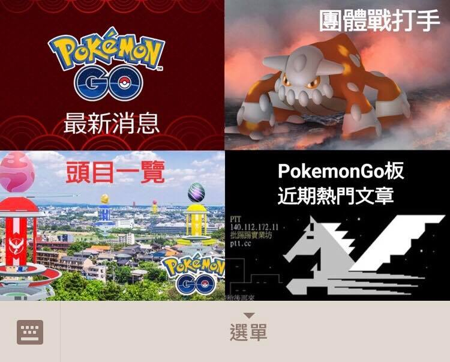
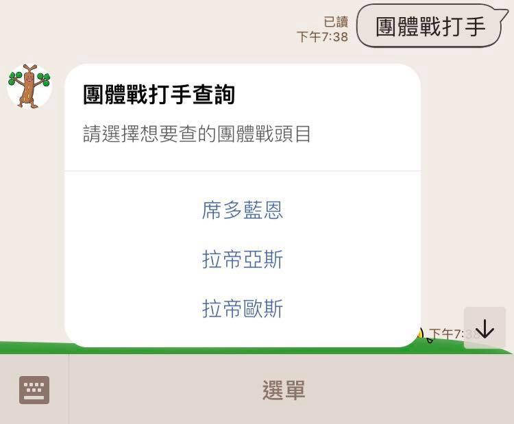
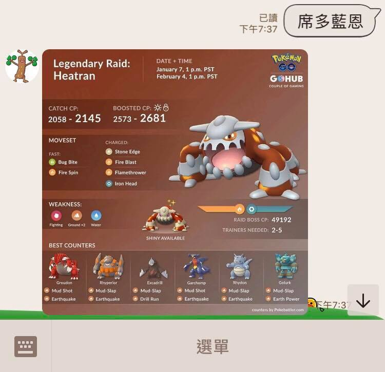
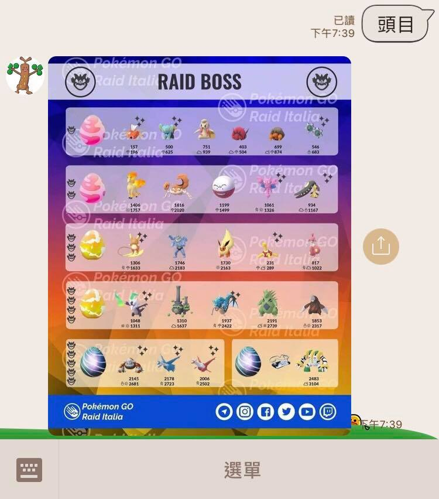
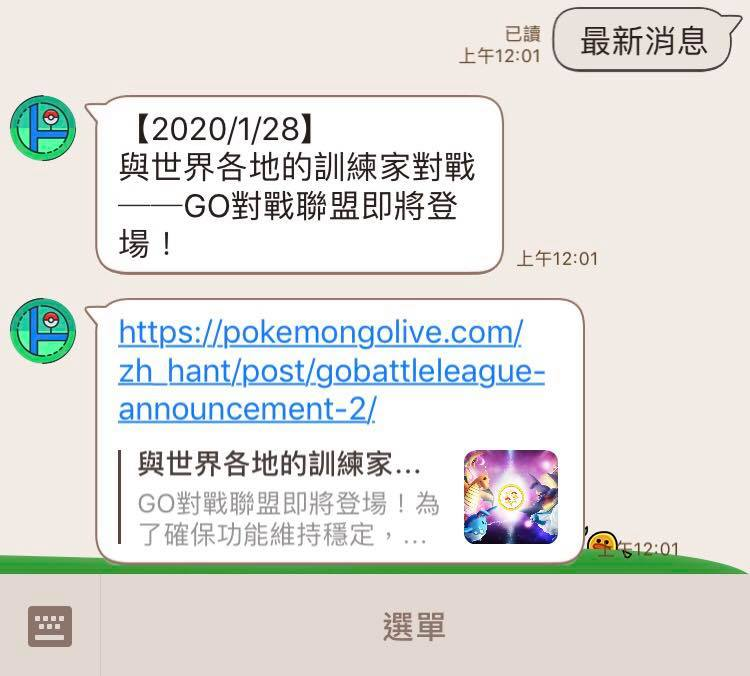
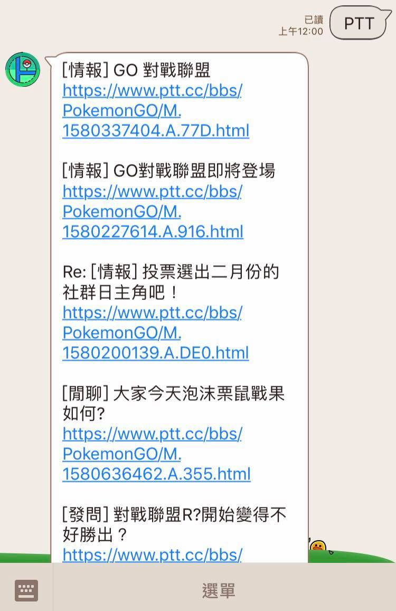

# Pokemon Go 團體戰小幫手

## 使用工具

* Python (含爬蟲 & 資料清理)
* Django + Database
* LINE Bot API
* imgur
* ngrok (測試)
* Heroku (部署)

## 功能

### v 1.1

以爬蟲完成兩項新功能:

* 最新官方消息 (文字+網址)
* PTT Pokemon Go版近期熱門文章 (文字+網址)

其他:

* 更改 icon

### v 1.0

以點按圖文訊息為主，提供以下功能

1. 團體戰攻略 (圖片)
2. 團體戰頭目一覽 (圖片)

---

## Demo

### 圖文選單

### 團體戰打手

1. 按鈕樣板
2. 傳送文字

### 頭目一覽

### 最新消息

### Pokemon Go 板近期熱門文章

