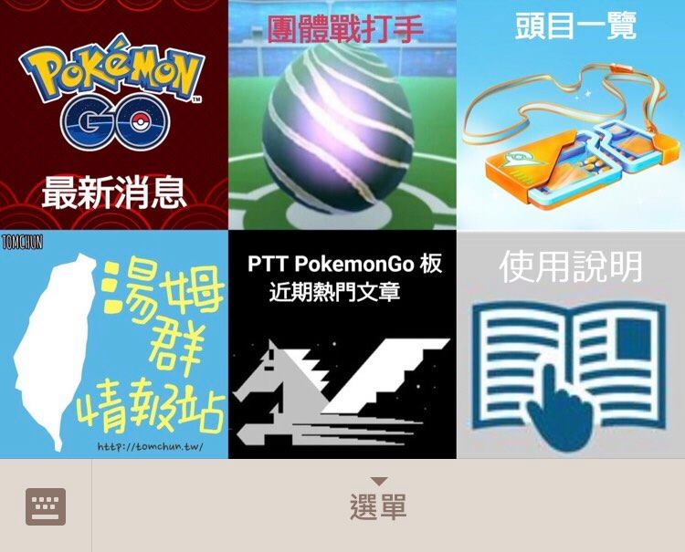
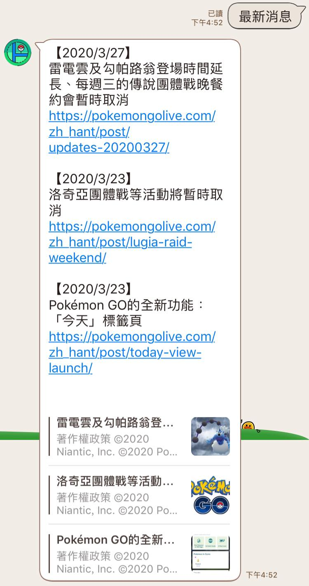
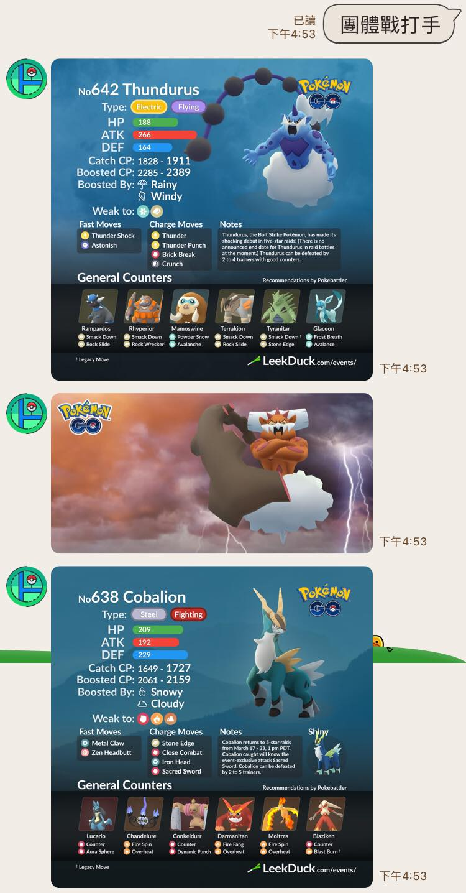
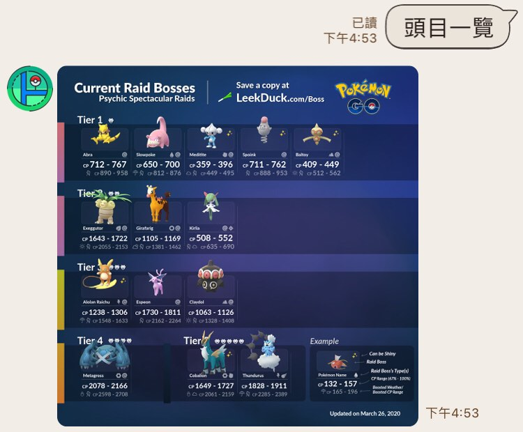
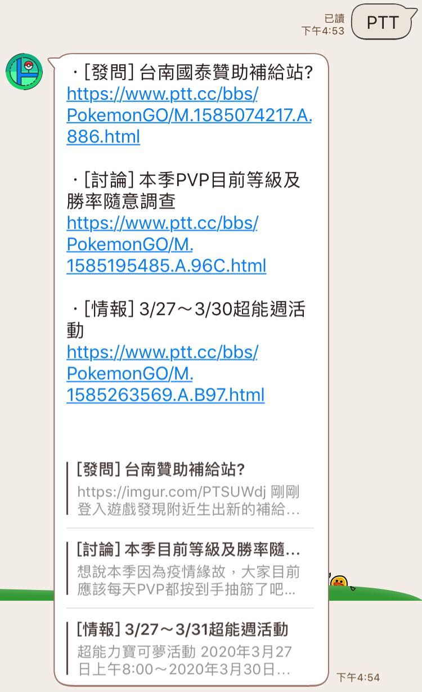
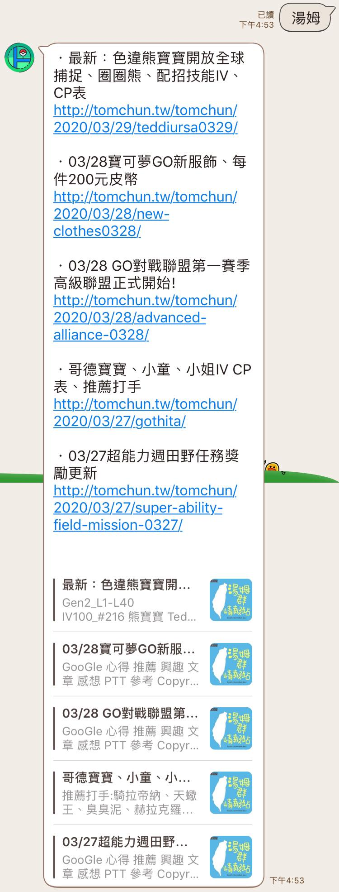

# Pokemon Go 小幫手

## 使用工具

* Python (含爬蟲 & 資料清理)
* Django
* LINE Bot API
* ngrok (測試)
* Heroku (部署)

## 功能簡述

### 圖文選單

1. 最新消息

        最新 3 則官網消息
2. 團體戰打手

        提供近期頭目的打手攻略圖 (最多顯示 4 個)
3. 頭目一覽

        提供當期所有頭目一覽圖
4. PokemonGo 板近期熱門文章

        提供近期推文數 > 50 的熱門文章
5. 湯姆群

        提供"湯姆群情報站"的最新五篇文章
6. 使用說明

        本 LINE Bot 的功能說明

### 文字輸入功能

1. 湯姆2

        不輸入數字預設為 1: 顯示 5 篇文章
        輸入"湯姆2": 顯示 10 篇文章 (5*2)
        輸入"湯姆3": 顯示 15 篇文章 (5*3)
        ...依此類推
        (數字前不要空格)

2. 其他任何文字

        會先搜尋 Pokemon Hubs 網站的頭目資訊
        若無法查到相關資訊，則回傳"抱歉! 查無資料"

## Demo

### 自製圖文選單

### 最新消息

### 團體戰打手

### 頭目一覽

### PokemonGo 板近期熱門文章

### 湯姆群

---

## 加入好友

1. ID

        @166edspc
2. QRcode

    

備註：

* 由於 Heroku app 會自動休眠，隔一段時間未使用時，第一則訊息回覆時間會較長

* 歡迎發 issue 或 PR 提供建議與想法

---

## 版本紀錄

### v 2.0 (Current version)

新增:

1. 湯姆群情報站的圖文選單
2. LINE Bot 使用說明

更新與修正:

1. 最新消息:
    * 顯示增加為 3 篇
    * 依據官網程式碼更動而修正爬蟲

2. 團體戰打手:
    * 更改選單圖示
    * 改為直接爬 LeekDuck 網站
    * 團體戰打手可顯示最多 4 個頭目的打手資訊
    * 顯示 1 或 2 個頭目時，可顯示該團體戰活動剩餘時間
    * 若尚無打手圖片，則顯示頭目封面圖

3. 頭目一覽:
    * 更改選單圖示
    * 改為直接爬 LeekDuck 網站

---

### v 1.3

新增功能:

1. 輸入"湯姆": 提供"湯姆群情報站"的最新五篇文章，"湯姆2"則為最新10篇，依此類推
2. 輸入其他文字: 會先搜尋 Pokmon Hubs 網站的頭目資訊，若無則回傳"抱歉! 查無資料"

更新與修正:

1. 頭目一覽: 改為直接爬巴哈最新一篇的"頭目表"文章
2. 團體戰打手: 改為爬 Pokemon Hubs 網站的最新"團戰指南"文章
3. 團體戰打手: 按鈕選項新增【當期BOSS】以供辨識
4. 團體戰打手: 按鈕選項會自動檢測有無更新，提供最新4個頭目查詢

---

### v 1.1

新增功能:

* 最新官方消息 (文字+網址)
* PTT Pokemon Go版近期熱門文章 (文字+網址)

更新與修正:

* 更改 icon

---

### v 1.0

以點按圖文訊息為主，提供以下功能

1. 團體戰攻略 (圖片)
2. 團體戰頭目一覽 (圖片)
